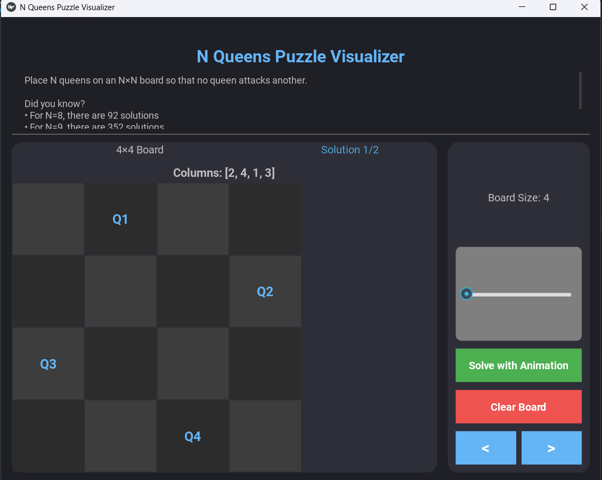

# N_Queens_Puzzle_Visualizer

A simple Python implementation to solve the **N-Queens Problem** using **backtracking**, now with a **graphical interface**! 🎨✨ Place `N` queens on an `N × N` chessboard such that no two queens attack each other.

## 🚀 Features
- **Interactive GUI** to visualize solutions.
- Solves the **N-Queens Problem** for any board size.
- Displays all possible solutions dynamically.
- Uses a **recursive backtracking approach**.

## 🔧 How to Run
1. Clone this repository or copy the `N_Queens_Puzzle_Visualizer.py` file.
4. Run the program:
   ```bash
   python N_Queens_Puzzle_Visualizer.py
   ```
5. Enter the board size `N` when prompted and watch the GUI show possible solutions! 🎉

## 🎯 How It Works
- The program places queens one by one in different columns.
- It **tries different positions** and backtracks if conflicts arise.
- Continues until all solutions are found!
- The GUI visually represents each solution, making it easier to understand the placements.

## 📌 Example (GUI Preview)
When running the program, a window will open showing the chessboard. Each valid solution is displayed step-by-step, with `Q` representing a queen's placement. 

Enjoy solving the N-Queens challenge visually! 🚀♟️🎨


